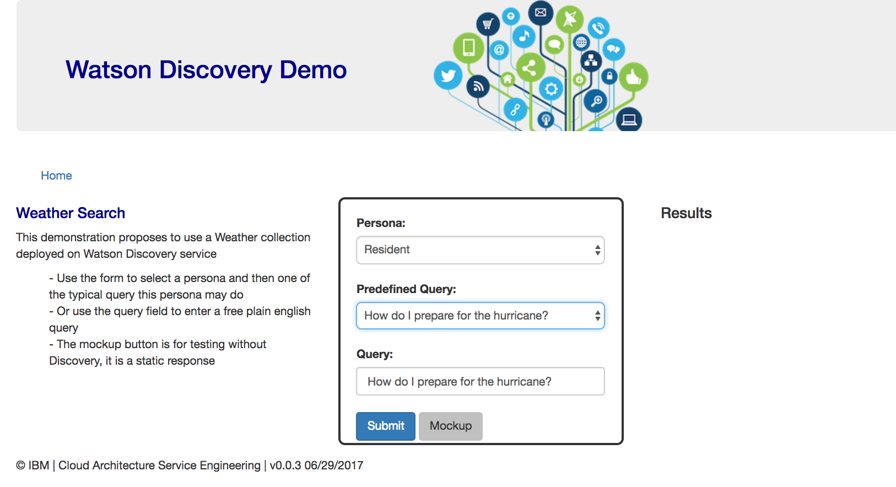

# Watson Discovery Broker User Interface Demonstration

We are addressing two use cases:
* [Querying the Watson News collection]() to search for information about a company and a product
* [Searching information about Hurricane]() in a private created collection. As part of the [tutorial](tutorial/wds-lab.md)

## Supplier query
This use case is linked to the Supplier on boarding process described in the Architecture Center [here](https://www.ibm.com/devops/method/content/architecture/cognitiveDiscoveryDomain2/1_2). Supplier due diligence business process involves assessing supplier risk and reputation.
So the approach is very simple.
* First from the home page:  

  

select the News link to reach the following page:  

  

Enter a company name and a product. For example: "IBM" and "API connect", then you should get the list of the top 5 most accurate responses with a score and sentiment:   

The scores are the document and sentiment scores computed by Discovery Service. Clicking on th url link goes to the article page.

## Weather query
### The business challenge
Residents  from counties and cities  who are prone to weather related  events  like hurricanes  rely  on news organizations,  TV, radio, mobile,  web and their own knowledge to do preparations  in case their city or county might get hit by a hurricane or are in the path of a potential  hurricane.  Counties deploy  emergency  workers who are temporary  workers who respond to common questions  related to hurricane  preparedness.  These emergency  resources  most of the time may not have the right information.  So the residents  sometimes  get the wrong information  and have to put in some effort to get the right information. The time it takes to get a response is important for events  like hurricane. Counties, cities  and states  work with utilities  etc. for emergency  preparedness.  Since the human resources  are temporary  resources,  these resources struggle  to find the right information. Enterprises  also struggle  to understand the impact of the hurricane to their business  (Supply chain disruption etc)Discovery  service  can be a decision  assistant  which can be trained  by ingesting  documents like How to install  hurricane shutters,  hurricane preparedness  guide, historical  supply  chain disruption information  and emergency  workers operations  guide etc.

### Script
From the home page select the Weather link.
  

Within the form in the middle select a *Persona*, like **Resident**, then the *Predefined query*: **How do I prepare for the Hurricane. The Query field is automatically populated from the selected query.
  

You could enter your own free text query, then hit the *Submit* button.

The 3 top results, sorted by accuracy score are returned. Click on one of the accordion and then explain the meta-data. They should be similar to the ones used by the Discovery Tooling Query.

The *Text* button open a modal to see the original paragraph. The text could have bean a HTML content, but the Weather collection configuration removed this attribute.

What is interesting for an analyst is to assess the taxonomy classification, the concepts and entities extracted. 
You can play with other queries.
