# Building a Discovery Service for Weather data

IBM [Watson Discovery Service](https://www.ibm.com/watson/developercloud/discovery.html) (WDS) is a Watson service that provides the developers the ability to rapidly add a cognitive, search and content analytics engine to application to identify patterns, trends and insights from **unstructured data**, that drive better decision making.
The purpose of this section is to show how to set up and configure Watson Discovery Service and how to inject documents about hurricane and weather management. Watson Discovery Service is only available on Bluemix.
Once created WDS instance allows you to ingest (convert, enrich, clean, normalize), store and query data to extract actionable insights.

You can create and configure a Watson Discovery service instance by using either the Discovery Tooling or the Discovery API. In the beginning of this tutorial we are using the Discovery Tooling to prepare the Discovery content and perform query, as most users will do, and then we go over the API for doing training, and access the service from a Web Application or a microservice.

The standard development path for using Watson Discovery is presented in the following diagram:
 {#fig:flow}

To summarize this diagram: to be able to do search / query we need content, that needs to be injected and persisted in *collection*. We are addressing these steps in this lab.

The labs files used for creating collection of documents are under the wds-docs folder.

The current working application to demonstrate the end product of this tutorial is here: [WDS Broker on Bluemix](https://refarch-wds-broker.mybluemix.net/)  

# Table of content
At the end of this tutorial you will be able to create a Discovery service and to prepare private document collection so a business analysts can use a custom bluemix web application to enter queries related to a specific subject, like weather to find interesting relation, concepts, a solution. As a developer you will have The sections are:

* [Create a Watson Discovery Instance](https://github.com/ibm-cloud-architecture/refarch-cognitive-discovery-broker/blob/master/doc/tutorial/wds-lab.md#task-1---create-a-watson-discovery-instance)
* [Prepare Data / Documents](https://github.com/ibm-cloud-architecture/refarch-cognitive-discovery-broker/blob/master/doc/tutorial/wds-lab.md#task-2---prepare-data--documents)
* [Execute query](https://github.com/ibm-cloud-architecture/refarch-cognitive-discovery-broker/blob/master/doc/tutorial/wds-lab.md#task-3---doing-first-query)
* [Work on more content](https://github.com/ibm-cloud-architecture/refarch-cognitive-discovery-broker/blob/master/doc/tutorial/wds-lab.md#task-4---upload-more-content)
* [Understanding Collection Configuration](https://github.com/ibm-cloud-architecture/refarch-cognitive-discovery-broker/blob/master/doc/tutorial/wds-lab.md#task-5---understanding-configuration)
* [Preparing document and more complex queries](https://github.com/ibm-cloud-architecture/refarch-cognitive-discovery-broker/blob/master/doc/tutorial/wds-lab.md#task-6---preparing-documents-and-more-advanced-queries)
* [Explore Discovery API](https://github.com/ibm-cloud-architecture/refarch-cognitive-discovery-broker/blob/master/doc/tutorial/wds-lab.md#task-7---explore-watson-discovery-api)


# Tutorial Structure
We organize this tutorial in layers to address different skill set.  

* **Level 0** - Data ingestion, Discovery tooling, and simple querying, seeing the output in the browser
* **Level 1** - Collection configuration, enrichment, filters, content / data preparation
* **Level 2** - API based access and refinement of results, Watson knowledge Studio, Watson API explorer, CURL or nodejs script to use API
* **Level 3** - Advanced topics. Explore the Discovery broker,  connecting discovery and conversation, using Speech To Text

For beginner you need to do this tutorial for level 0 and 1 which map to tasks from 1 to 6, so you will be able to understand how Discovery works.

For developer try to do all the 4 levels to get a deep understanding of the service.

# Prerequisites
* Create a Bluemix account: Go to Bluemix (https://console.ng.bluemix.net) and use the **Create a Bluemix account** if you do not have one.
* Execute the Task 1 in advance

For developer the following are assumed
* Having a Bluemix account, how to search the service catalog and how to create services
* Using Bluemix command line interface
* Programming in nodejs & expressjs
* Having a github account and how to use git commands

# Level 0 - Configure Discovery Service
The Watson Discovery Service or WDS is listed under the Watson section of the Bluemix catalog. Before you start you need to create a service instance.

## Task 1 - Create a Watson Discovery Instance
This will allow you to create an environment where you can create one or more data collections into which you can add your own content and associate with a configuration.
1- Select “Catalog” from the top right corner to view the service catalog.  


Go to [Watson Discovery Service on Bluemix] (https://console.bluemix.net/catalog/services/discovery/?cm_mc_uid=35796192015914973653529&cm_mc_sid_50200000=1497371009&cm_mc_sid_52640000=1497371009&env_id=ibm:yp:us-south)  

2- From the Bluemix Catalog; first select “Watson” then select **Discovery**  

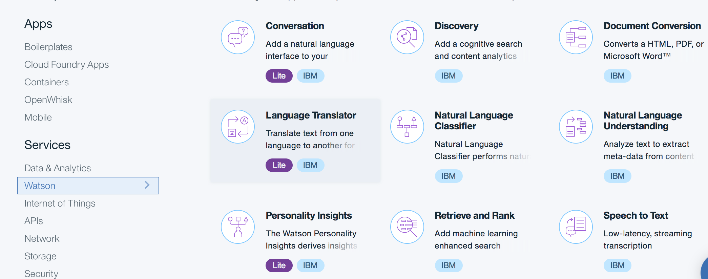  

3- On the Discovery page; Select “Create” and wait for the instance to be created.  


4- Create collection:  

The Discovery service includes a complete set of online tools **the Discovery Tooling** to help you quickly setup an instance of the service and populate it with data.  


The Discovery service Tooling has been designed to save time by eliminating the need to use APIs to configure and populate your service. This lets application developers concentrate on creating high value ways for end users to experience the Discovery Service. In the Discovery service, the content that you upload is stored in a **collection** that is part of an **environment**. You must create the environment and collection before you can upload your content. So use the **Create a data collection** and name your new collection as **Weather**   

  

Each collection you create is a logical division of your data in the environment. Each collection will be queried independently when you get to the point of delivering results.

## Task 2 - Prepare Data / Documents
As illustrated in the development path diagram above @{fig:flow}, the data acquisition work is very important and may take some time depending of the document quality. Let illustrate that: Our use case is related to hurricane knowledge, so searching for source of knowledge we can use private data owned by our company or public content.

Let start simple going to [https://www.ready.gov/hurricanes](https://www.ready.gov/hurricanes) URL with a web browser we can see interesting source of knowledge about being ready for hurricane. The HTML page also contents noisy data, like menu links, images, ads... so we may need to prepare the document, by removing unwanted content and how to prepare passage extraction: we will address that in later section [Preparing document](https://github.com/ibm-cloud-architecture/refarch-cognitive-discovery-broker/blob/master/doc/tutorial/wds-lab.md#preparing-document).  First, from the web browser, we can *print* the page as pdf file. This page was saved as pdf document, for you to use, as wds-docs/Hurricanes_Ready.pdf. Next step is to upload it to the collection just created.

Using the Discovery Tooling, select your *weather* collection then from the main page use the **Add data to this collection** drag and drop panel


You should get a message about successful upload. So let do a simple query.

## Task 3 - Doing first query
As soon as one document is uploaded you can start doing some query in plain language. Select your collection from the Discovery tooling main page, then using the *Query this collection* button on the top left, you should reach the *My data insights* page:


**Top keywords** displays the most important topics in your documents, discovered by the Keyword Extraction enrichment.

On the left side it is possible to filter out the content based on enrichment done by the document ingestion step. See

The following diagram illustrates a document section we want to search for:   
Using the *Build your own query*, you reach the *Ask a question in plain language* and enter the query: **What to do when hurricane is 6 hours from arriving?**   
When creating a query, you can be as vague or as specific as you want. The more specific the query, the more targeted the results.

The following diagram illustrates the JSON responses returned

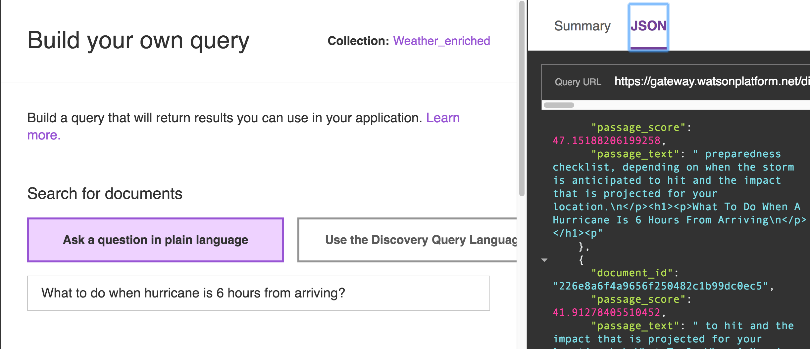

We can see the passage text does not perfectly match the expected section. But very close, so the default conversion works. Passages are short, relevant excerpts extracted from the full documents returned by your query. These targeted passages are extracted from the text fields of the documents in your collection.

The very interesting content is in the JSON results which lists the generated semantic analysis like *Taxonomy, Keywords, Entities*

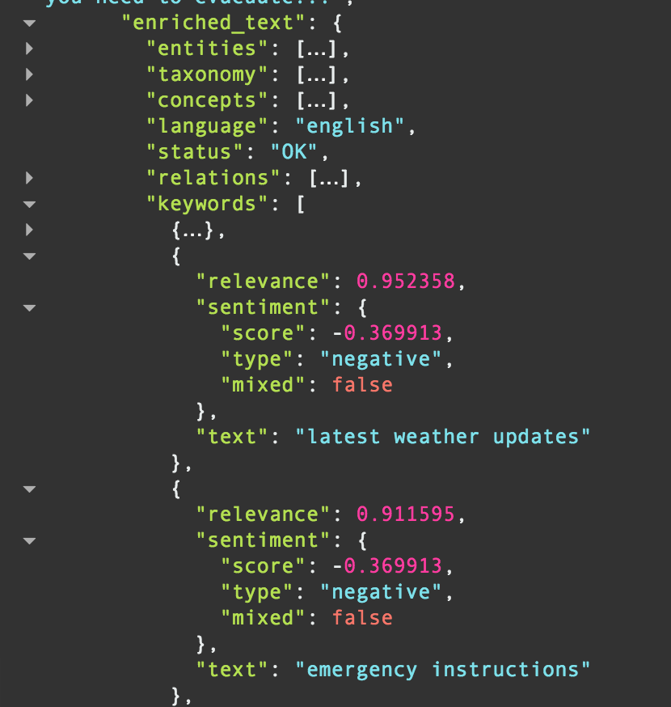

During the ingestion step all of your documents are converted to JSON before they are enriched and indexed. Microsoft Word and PDF documents are converted to HTML first, then JSON.

By default, Discovery will enrich (add cognitive metadata to) the text field of your ingested documents with semantic information collected by these six Watson functions: Entity Extraction, Keyword Extraction, Taxonomy Classification, Concept Tagging, Relation Extraction, and Sentiment Analysis.
Expand the JSON tags by clicking on the triangle icons before the tags to view all transformations on the right side panel.

## Task 4 - Upload more content
So far you have worked with one document, you need to upload more content to get better results and being able to do more complex queries.

Using the drag and drop capability in the Collection Main page: 
 the following documents from the **wds-docs/L0** folder:
* `Zhang_et_al-2009-Disasters.pdf`  a research paper about the major findings within the business development research
 field and the disaster research field, for evaluating business vulnerability to natural disasters.
* TBD

# Level 1 - Collection configuration
## Task 5 - Understanding configuration
Collections are associated with configuration. Configuration controls how the **Convert, Enrich, and Normalize** steps are performed during document ingestion.

From the main page of the **Weather** collection, use the Switch hyperlink to prepare for a new configuration


Then use the *Create new configuration* link, and finally in the next form enter a configuration name:
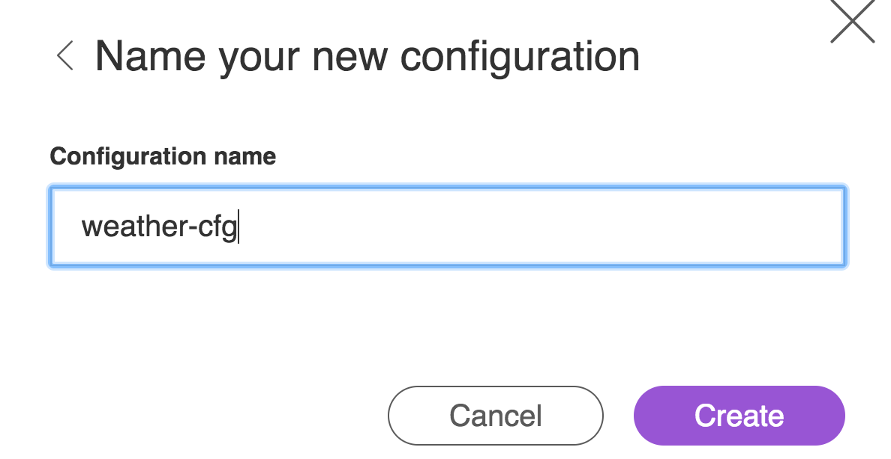

### Convert
The first step is the document conversion. Depending of the source type, you can specify the conversion rules:  

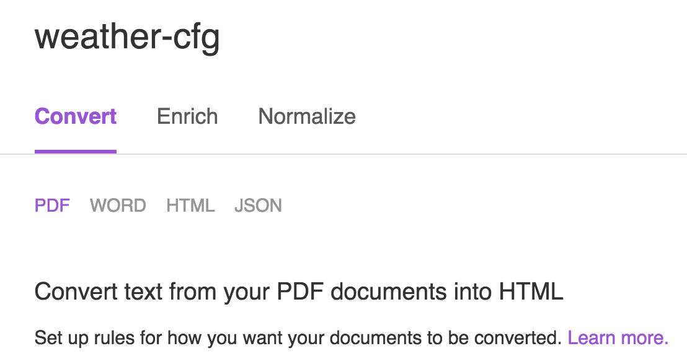

For *pdf, and Microsoft Word* the conversion rules are based on the font type and size to assess the heading type. This is the less efficient format as input because some document may use header 1 font size differently. The range font size should help to address this problem. But the preferred format for input document is html.

The HTML rules are applied to input HTML documents but also to *pdf and Word* converted documents. The default HTML rules should work for most case.

Finally for JSON, you can control the attributes you need to keep. For example the *html* view of the document may not be needed, so use the **Move, merge, copy or remove fields* choice as illustrated below:


### Enrich
The second configuration is related to **Enrich** step.

By default, Discovery will enrich (add cognitive metadata to) the **text** field of your ingested documents with semantic information collected by these six Watson functions - Entity Extraction, Keyword Extraction, Taxonomy Classification, Concept Tagging, Relation Extraction, and Sentiment Analysis.

For example *Entity extraction* adds semantic knowledge to content to help understand the subject and context of the text that is being analyzed. In the example below, the term 'Hurricane' was classified as 'NaturalDisaster' with a 86% relevance.

```JSON
{
      "type": "NaturalDisaster",
      "relevance": 0.86074,
      "sentiment": {
        "type": "negative",
        "score": -0.551763,
        "mixed": false
      },
      "count": 13,
      "text": "Hurricane",
      "disambiguated": {
        "name": "Tropical cyclone",
        "dbpedia": "http://dbpedia.org/resource/Tropical_cyclone",
        "freebase": "http://rdf.freebase.com/ns/m.07r2x",
        "yago": "http://yago-knowledge.org/resource/Tropical_cyclone"
      }
    },
```

Discovery automatically identifies and ranks keywords in the document which could be used when indexing data, generating tag clouds, or when searching

Taxonomy classification is very important to classify content into a hierarchical taxonomy. The example below  is telling us that the document section related to Hurricane can be classified as meteorological disaster at 71% relevance, while it is not really a earthquake. The label is the detected taxonomy category.

```JSON
"taxonomy":[
			{
				"label": "/science/weather/meteorological disaster/hurricane",
				"score": 0.711586,
				"confident": false
			},
			{
				"confident": false,
				"label": "/science/geology/seismology/earthquakes",
				"score": 0.396216
			},
			{
				"confident": false,
				"label": "/science/weather",
				"score": 0.318234
			}
		],
```

Concept tagging understands how concepts relate, and can identify concepts that are not directly referenced in the text, it enables higher level analysis of input content than just basic keyword identification.

```JSON
 "concepts": [
  {
    "text": "Emergency management",
    "relevance": 0.984327,
    "dbpedia": "http://dbpedia.org/resource/Emergency_management",
    "freebase": "http://rdf.freebase.com/ns/m.052yrz"
  },
  {
    "text": "Emergency evacuation",
    "relevance": 0.938583,
    "dbpedia": "http://dbpedia.org/resource/Emergency_evacuation",
    "freebase": "http://rdf.freebase.com/ns/m.058th7"
  }
]

```

You can remove *Sentiment Analysis* in the text field as for the weather semantic we may not need it. As of curiosity, you can also look at the **Add enrichments** to see the options available:


### Normalize
The last step in customizing your configuration file is doing **normalization**. From Discovery Tooling you can select the 'do not publish empty content'.

## Task 6 - Preparing documents and more advanced queries
Normally with Custom configuration and document conversion capability you should be able to ingest any documents. But we did observe that you need to do some document review and may do some cleaning upfront to get cleaner results.

### Preparing documents
For example starting with the following PDF file:
Hurricanes_Ready.pdf, this is a PDF print of the website.

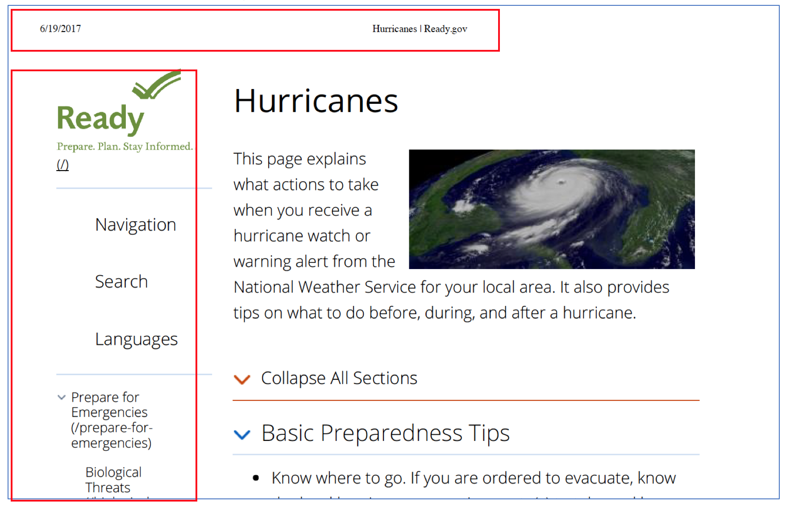  

Everything inside the red boxes is considered ‘dirty’ and needs to be removed.

This editing can be done in Adabo Acrobat, available via the Mac@IBM App Store application or by exporting the PDF to a Word document and manually editing the content.

To export a pdf to word, an in-between step is needed. First, save the document as a plain-text file. Go to:

  
And save the file.  
Now open the plain-text file in document editor compatible with Microsoft Word. Accept the default setting for conversion. The file should look like this:  
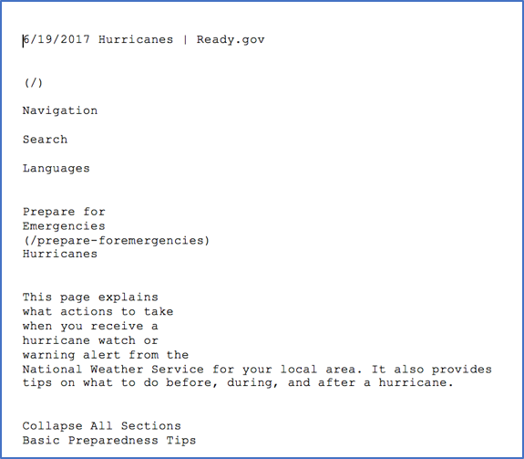  
Now clean it up by removing all HTML Headers and navigation text.

The result should be something like this:
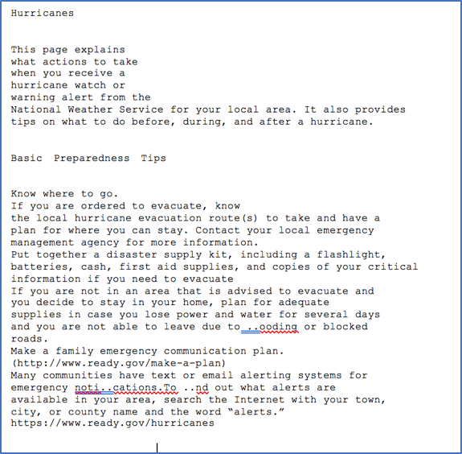
In the next step you need to change the font-size of headers, so Watson Discovery can determine the sections and content.

Make the headers font-size 18, sub-headers in font-size 16 and let the body be as-is.

The result should be like this:
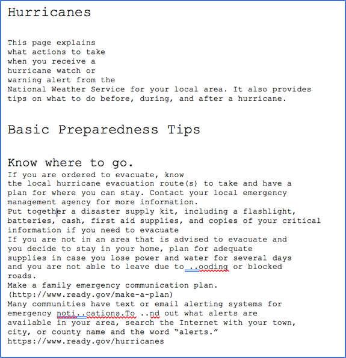
As a final step, save the file as a PDF on your laptop with the same name as the original PDF document. By using the same name, Watson Discovery will not add it as a second document to the collection but will refresh the originally uploaded document.

Upload it to your **Weather** Collection.


### Advanced queries
Discovery comes with a query language ...


# Level 2 - API and training
## Task 7 - Explore Watson Discovery API
The objective of this step is to explore the power of Watson Discovery Service APIs. After completing this section, you will be able to perform the following:

1.	Exercise the APIs to create and alter the discovery service instance (including collections and documents)
2.	Exercise the APIs to issue queries
3.	Fine tune the results using training

Note: Like the previous sections, this section has certain verification steps that you need to complete to get Think40 credit and earn the badge. These steps are described in shaded boxes.

Watson Discovery Service provides a rich set of APIs to work with the environments, configurations, collections, documents and issuing queries. In the previous section, you explored the same features using the discovery tooling. In this section we will do the same using the APIs.

As you know, Watson Discovery Service provides APIs in various languages like Python, Java, Node and command line option using Curl. The following URL shows all the REST APIs for the Discovery service.

https://www.ibm.com/watson/developercloud/discovery/api/v1/

In this exercise we will use the API Explorer tool to get comfortable with the APIs. You are encouraged to test the APIs using your language of choice on your own. The steps involved in using the APIs are as follows –

(1) Obtain the connection to your discovery service instance
(2) use one of the standard HTTP requests like GET, PUT, POST, DELETE with parameters appropriate for the given invocation

Open a browser and access the Watson API Explorer page  https://watson-api-explorer.mybluemix.net/. The screenshot of the page is shown below

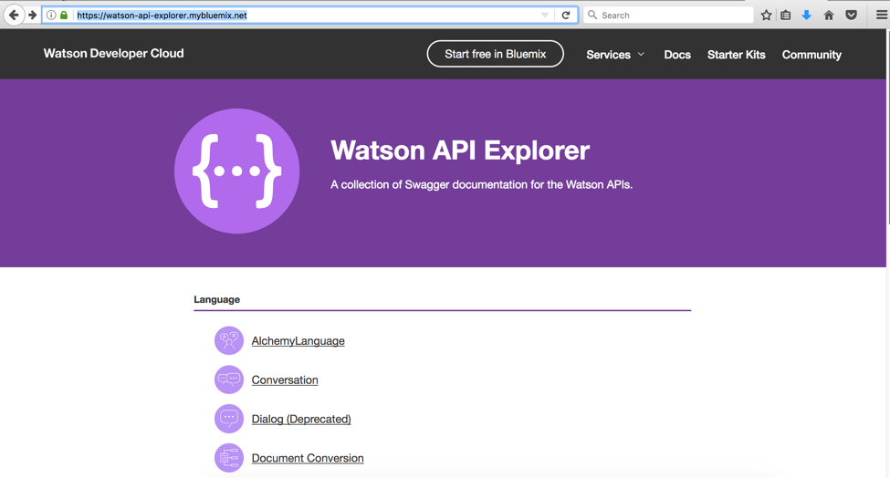

Scroll down the page and click on the “Discovery” link to access the API explorer for Discovery service. The screenshot is shown below for illustration.

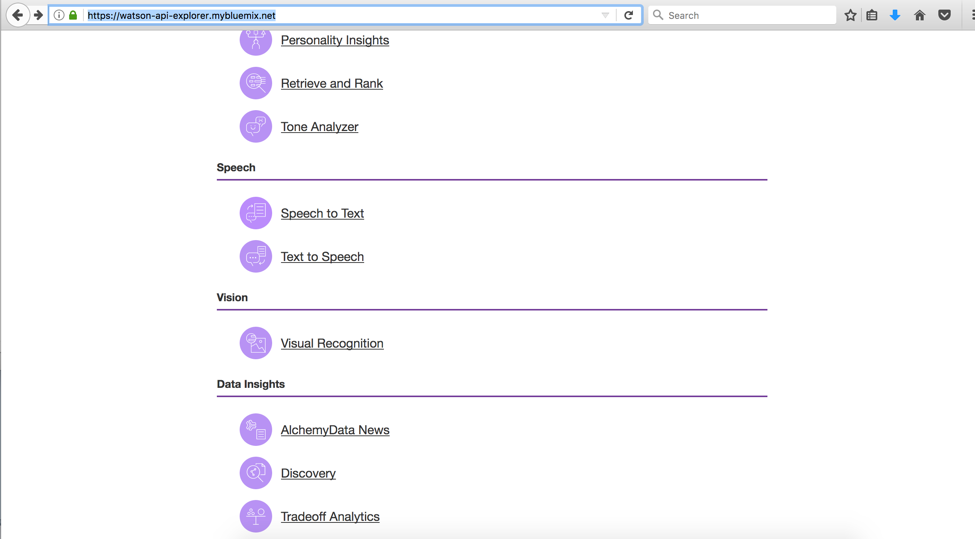

Upon clicking, you will be taken to the following page, where you can see APIs corresponding to various operations specific to Discovery.

https://watson-api-explorer.mybluemix.net/apis/discovery-v1

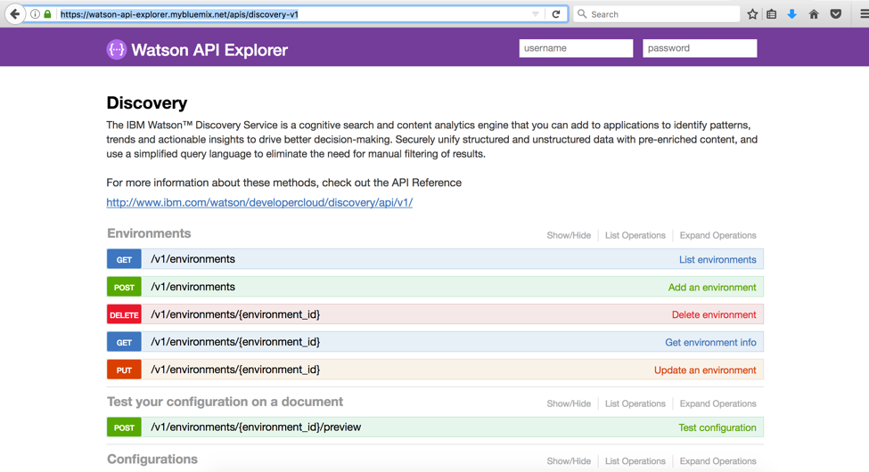

In the rest of the remaining exercise we will try a few APIs using this explorer tool. To invoke the APIs, you need the credentials configured with your discovery instance. The steps to get the credentials (username and password) is outlined in one of the earlier sections [refer to that section from here once the documentation is complete].

First get your credentials, and input them in the username and password fields at the top right of the page as indicated by a yellow rectangle in the following screenshot. [There is no button like submit or any thing. Just make sure those two fields filled in throughout this exercise. The values are not erased after each API invocation, so you shouldn’t have to fill-in those values each time]


The credentials you just configured acts as the credential for all the API invocation.

To start with a simple one, let us list the available environments. On the API page (same page shown above) go to the “Environments” section, and click on “List environments” (on the right most column as highlighted in the following picture).


The resulting screen with the API details should appear like the following. The details are self explanatory.

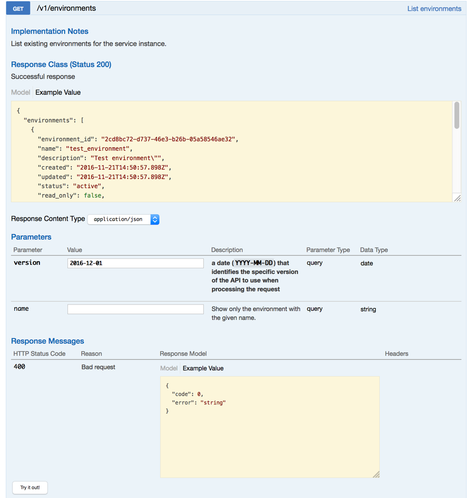

The first few sections starting from “Implementation Notes” outline the signature and the response structure of the API. The text field “Example Value” shows the example output value for a fictitious “Test environment”. The actual value for this may be different for your case. If you want to see the schema of the output, you can click on the “Model” (greyed option left of the title “Example Value”). That will refresh the text field with the structure of the response. As for the “Parameters” section, don’t change the value for “version” shown in the screen (should be 2016-12-01), as that is the only available version of the discovery service. In the “name” field you can input any value you want, though, for this exercise, you can leave it empty and press the button “Try it out”. This will show you the response like the following. A “Response code” of 200 indicates successful invocation, and with the response filled in the text box “Response Body”.
Look at the Curl command, which you can execute from the command prompt if you want (those of you not familiar with Curl, no need to try it because we are testing the APIs using an alternative mechanism, which is this explorer tool).

Look at the request URL and familiarize yourself as to how the parameters are passed.

Inspect the content of the text box with label “Response Body” to study the output of the API invocation. Depending on the results in your case, you may see a scroll bar on the right edge of the text box – you may need to scroll down to see all the response content.

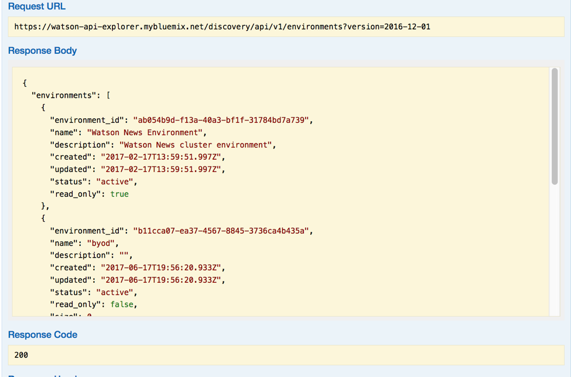

That was a simple API call for you to get a feel for how this works. When you invoke this using Java or Python or Node, the same concept applies, with the only difference being the language specific bindings and constructs.

Now go ahead and collapse this API by clicking on the “List Environments” for this API, and click on “Update an environment”. As for the input values –

•	environment_id: Copy the environment_id for the collection you created earlier. The steps to find the environment_id is outlined in one of the earlier sections
•	body: Click on the text box with label “Example Value” (on the right side of the “body” input text field). This will copy the skeleton payload in the “body” input text field. Change the values for “name” and “description” to whatever values you like.

With all the input fields filled in, the screen should look like the following. Click on “Try it out” button.

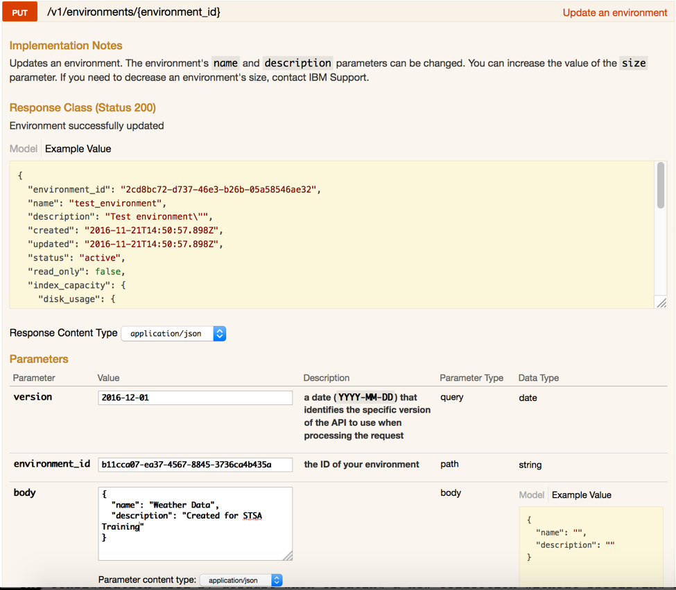

The response should look similar to the following. Scroll down the response body and study the response values.

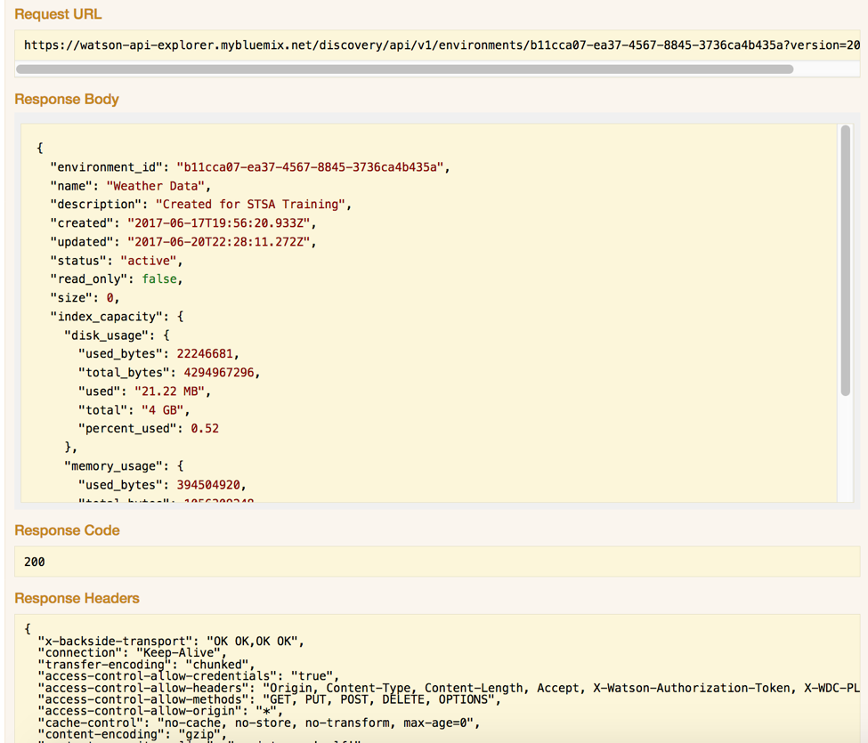

The above invocation set the name and description, but you can verify that by issuing another API “Get environment info”.

Click on “Get environment info” and fill the input field “environment_id” with the same value you used above. Click on “Try it out” and inspect the response body. Now you should see the values you set for “name” and “description” fields using the previous API (update an environment).

The sequence of the APIs above illustrates the structure and the invocation mechanism behind the discovery service APIs.

As a next API, let us try to test a sample document sending it through the conversion, enrichment, and normalization steps. Expand the API “Test configuration”. By now the parameters should be self explanatory to you. Accept the default for “version”, and fill in the values for “environment_id” and “configuration_id” from your specific collection. For the parameter “step”, pick one of the values from the drop down box (this example tests conversion by performing PDF to html_output). Click the “browse” button and choose the file “checklist_2014.pdf” from the dataset provided to you. You are welcome to choose any other file to experiment with this step. Leave the “metadata” field empty, and your parameters should look like the following before invocation.

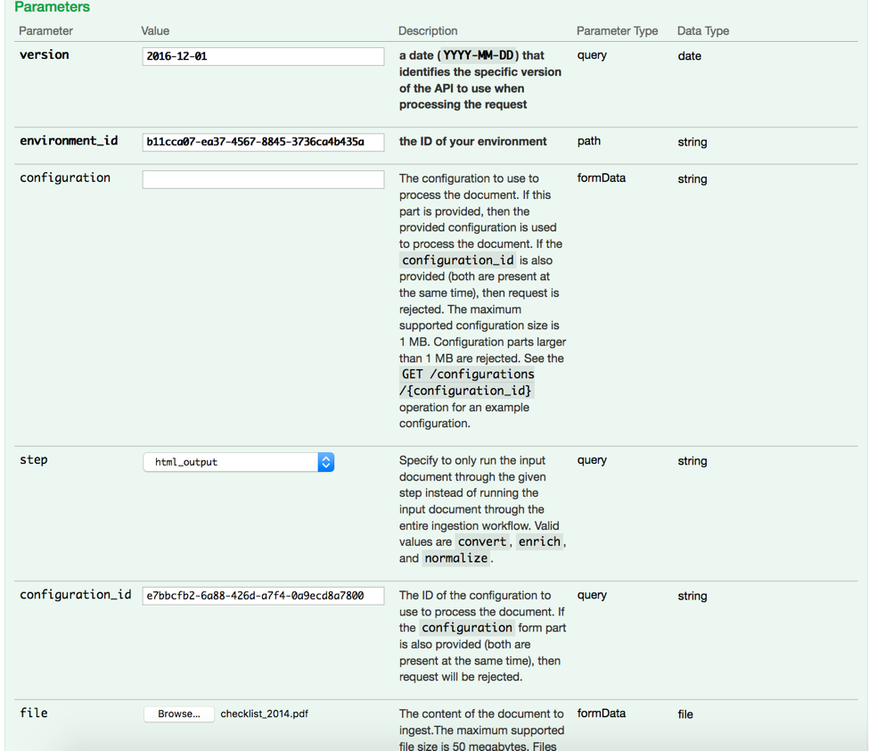

Now click “Try it out” button. The result should look like the following.


|To verify that you worked through the exercise, test the configuration for the file “CDC_Plan_Hurricanes.pdf” and provide the relevance score for the concept “wind shear”.|

As a next exercise, let us try working with collections. Collections are the most important, and fundamental artifacts you need in order to be able to make queries and use the features of discovery service.

Click on “List collections”. Provide the right value of the input field “environment_id” and click “Try it out”. To make sure this works correctly, you may want to go back to the tooling and create one or more collections, and try this API again. In the response section you should see all the collections.

The request part of the API should look like the following:

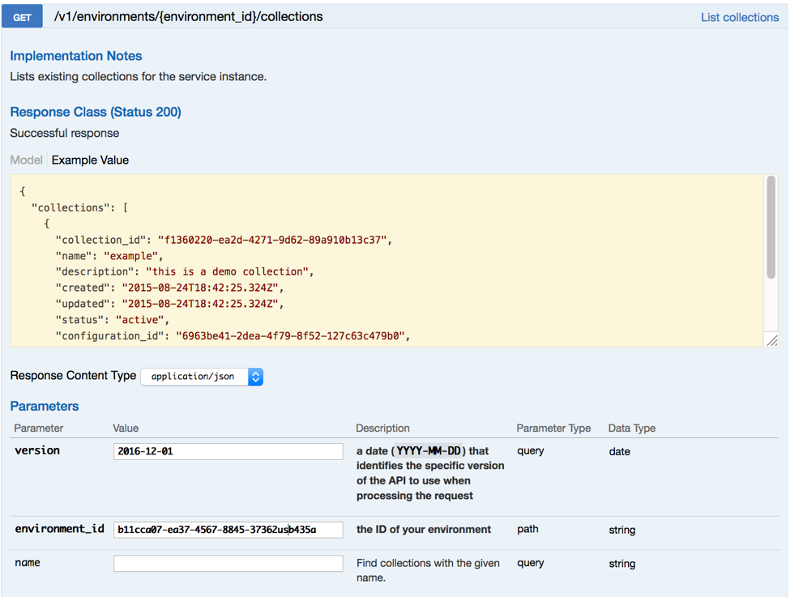

The response should look somewhat like the following:


As you can see, I have two collections namely “HurricaneInfoCollection” and “InitialTestCollection”. Your results may vary depending on how many collections you created prior to invoking this API.

Now let us create a new collection using API and verify it was created. You can verify it using the tooling as well as using the API invocation like we did above with ‘List Collections”.

Go ahead and expand the API “Create a collection” and configure the request with input parameters like environment_id etc. Click on the text box with label “Example Value” (right next to “body” input field). That will copy the skeleton body into the input text field. Pick a name for your collection and description (feel free to leave the configuration_id) and click on “Try it out”. The following screenshot shows the request for creating a collection “AnimalKingdomCollection”.


The response should look like the following:

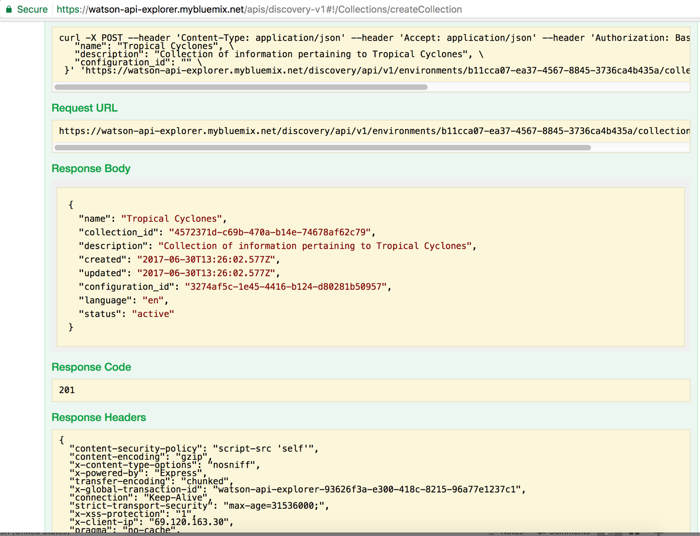

Now go back to the tooling and verify this collection shows up in the list of collections.  Launch the discovery tooling from the UI using “Launch tool” button –


In the resulting screen you should be able to see the newly created collection.

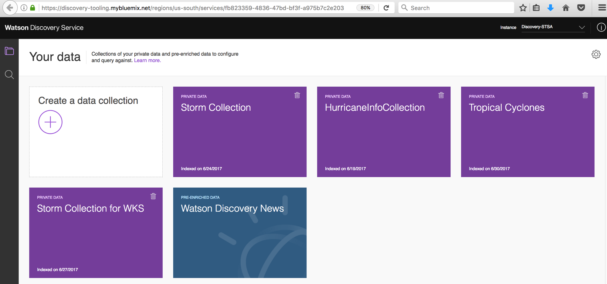

Now invoke the “List collections” API again and verify this newly collection creation shows up in the response section.

Now try the API to delete the newly created collection. You need the collection_id for the newly created collection in addition to the environment_id. You can get the collection_id in one of the two ways. At this point of the tutorial you should be able to do both the following with ease, but for your reference the steps to find the collection_id are outlined along with the screenshots.

•	Go back to the tooling as shown above and click on the AnimalKingdomCollection (or the one you just created, if you used a different name). You should be able to see the collection_id. The screenshot is shown below, and the collection_id is highlighted for your reference.


•	Invoke the API “List collections” and retrieve the collection_id. The response is shown in the following screenshot along with the collection_id.


Once you get the collection_id using one of the methods outlined above, use that to invoke the API “Delete a collection”. Now go to the tooling and make sure the collection is deleted, and optionally you can try the “List collections” API again to verify the newly created collection no longer shows in the response.

At this point you should be able to try additional APIs without the help of screenshots. You should also be able to retrieve things like environment_id, collection_id etc. From this point onwards the remaining instructions will assume you can create a collection, retrieve the metadata about the collection.

Now let us try adding a new document through the APIs. Create a new collection for this purpose, or you can work with one of your existing collections. The following example uses a newly created collection called “StormCollection”. It is easier if you stick with the same subject (like hurricane, storm, cyclones, weather etc.) because you can use one of the existing documents provided with this tutorial.

Let us use the API to add the document “FloodSmart_FEMA.pdf” which is included in the data set. Expand the API “Add a document” and fill in the input parameters. You can leave the configuration, metadata etc. empty. Choose the file “FloodSmart_FEMA.pdf” using the “Browse…” button. The input parameters should be configured as shown in the following screenshot (with the exception of environment_id and collection_id which will be unique to your own environment and collection)

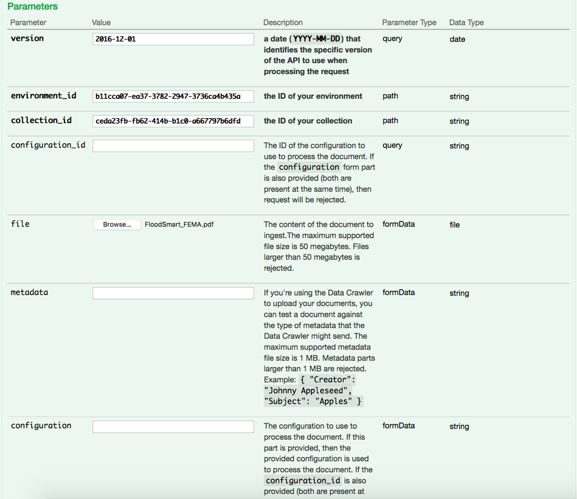

Click on “Try it out” and look at the response. The response may involve the status set to “processing”. That’s okay because the API returns immediately while the document is being processed and included in the collection. The sample response is shown in the screenshot below, with the “status” field of the JSON response highlighted using a rectangle.

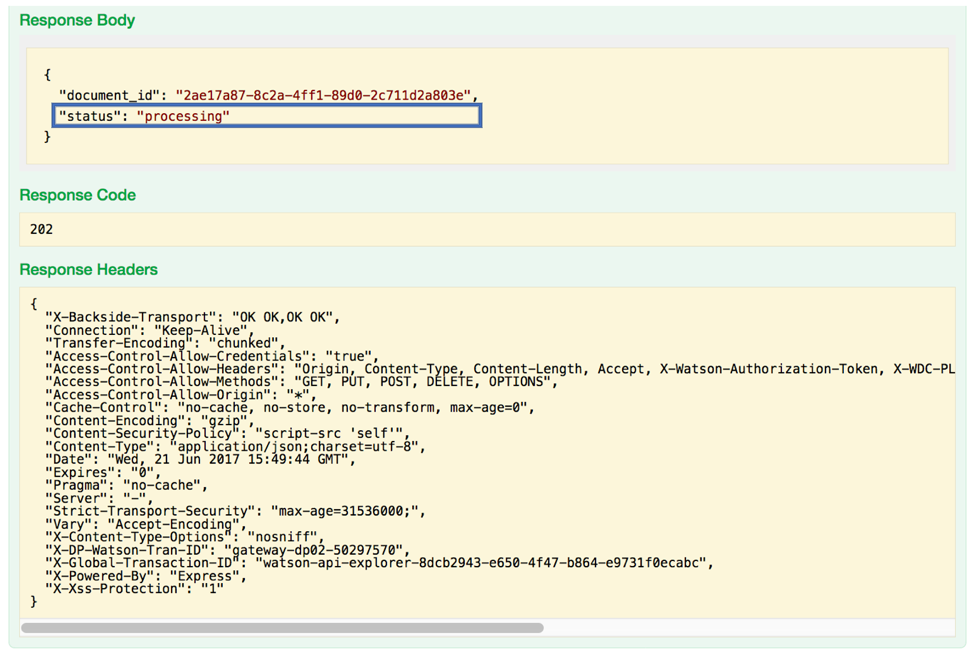

Go back to the tooling, and open the collection (in this example, StormCollection, but you may have chosen a different name) and verify it shows a document has been added. A screenshot is shown below highlighting the document count.

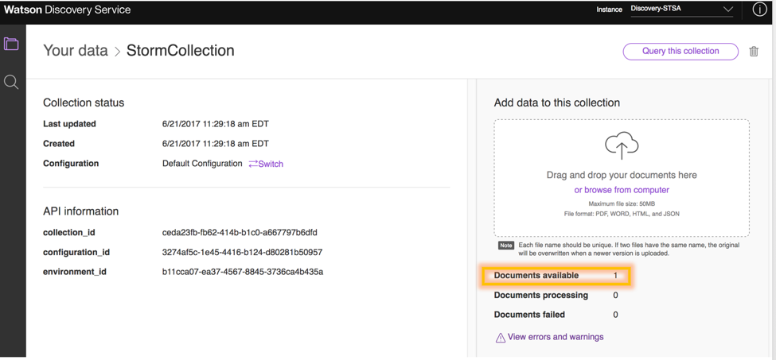

You can issue a simple query related to this document and make sure it works. Ofcourse there is only one document in the collection, so the number of queries you can issue will be limited to the content addressed in the “FloodSmart_FEMA.pdf” file.

As the last step, let us see how to issue queries using the APIs. Expand the “Query documents” API and fill in the input fields. In addition to the usual mandatory ones like environment_id and collection_id, you also need to provide value for either the “query” field (in structured format) or “natural_language_query” (in natural language) to test this part. Optionally you can also provide values for “filter”, “passages” etc. Assuming you used the FloodSmart_FEMA.pdf file to add the document, type the text “Do I need flood insurance?” in the “natural_language_query” input field. Click the button “Try it out”, and you should see a response like the following.


Inspect the Response Body to check the results.

|For earning the badge, use the APIs to load the file Hurricane_noaa.pdf, and run the query “What is Saffir-Simpson scale?”. In the result, find the concept “Beaufort scale” and describe the relevance and other details reported in the response|

# Configure Watson Discovery Service via APIs
We will use API to do training set and test set to validate accuracy.
https://watson-api-explorer.mybluemix.net/apis/discovery-v1

## Task 7 - Training with API

# Level 3 - Advanced Topics - Developer centric
## Task 9 - Broker code explanation

## Link between Conversation and Discovery
To support long tail interaction, Watson Discovery in conjunction with Conversation is used to support end user's query which could not be completed with pre-defined dialog flow. So the broker code is propagating the query or transform it so it can be processed by WDS and the results are returned.

# References
* [Discovery main page](https://www.ibm.com/watson/developercloud/discovery.html)
* Discovery [API](https://www.ibm.com/watson/developercloud/discovery/api/v1/#introduction)
* Mix of Image Recognition and Discovery  http://watson.ted.com/
