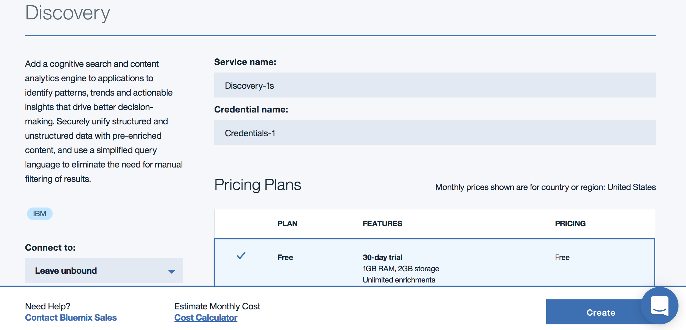
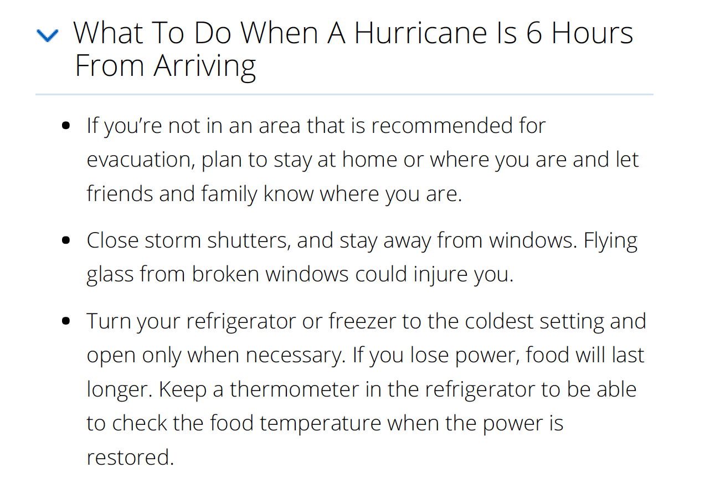

# Building a Discovery Service for Weather data

IBM [Watson Discovery Service](https://www.ibm.com/watson/developercloud/discovery.html) (WDS) is a Watson service that provides the developers the ability to rapidly add a cognitive, search and content analytics engine to application to identify patterns, trends and insights that drive better decision making.
The purpose of this section is to show how to set up and configure Watson Discovery Service and how to inject document about weather management like hurricane. Watson Discovery Service is only available on Bluemix.
Once created WDS instance allows you to ingest (convert, enrich, clean, normalize), store and query data to extract actionable insights.

You can create and configure a Discovery service instance by using either the Discovery Tooling or the Discovery API. In the beginning of this tutorial we are using the Discovery Tooling to prepare the Discovery content.

The standard development path for using Watson Discovery is presented in the following diagram

To summarize: to be able to do search / query we need content, that needs to be injected and persisted in *collection*. We are addressing these steps in this lab.

We organize this tutorial in layers to address different skill set.

The labs files used for creating collection of documents are under the wds-docs folder, see the section about [document preparation](https://github.com/ibm-cloud-architecture/refarch-cognitive-discovery-broker/blob/master/doc/tutorial/wds-lab.md#step-2---prepare-documents).

# Prerequisites
For beginner you need to:
* Create a Bluemix account: Go to Bluemix (https://console.ng.bluemix.net and create a Bluemix account if you do not have one.
* To create the Discovery content and be able to search within the knowledge base, follow the steps 1 to 3

For developer the following are assumed
* Having a Bluemix account, how to search the service catalog and how to create services
* Using Bluemix command line interface
* Programming in nodejs & expressjs
* Having a github account and how to use git commands
* Prepare the Discovery service as described in steps 1 to 3

# Table of content
* [Create a Watson Discovery Instance](https://github.com/ibm-cloud-architecture/refarch-cognitive-discovery-broker/blob/master/doc/tutorial/wds-lab.md#step-1---create-a-watson-discovery-instance)
* [Prepare Documents](https://github.com/ibm-cloud-architecture/refarch-cognitive-discovery-broker/blob/master/doc/tutorial/wds-lab.md#step-2---prepare-documents)
* [Execute search](https://github.com/ibm-cloud-architecture/refarch-cognitive-discovery-broker/blob/master/doc/tutorial/wds-lab.md#step-3---doing-some-query)
* [Improve Accurancy]()

# Configure Discovery Service
The Watson Discovery Service or WDS is listed under the Watson section of the Bluemix catalog. Before you start you need to create a service instance.

## Step 1 - Create a Watson Discovery Instance
This will allow you to create an environment where you can create one or more data collections into which you can add your own content and associate with a configuration.
1- Select “Catalog” from the top right corner to view the service catalog.  

Go to [Watson Discovery Service on Bluemix] (https://console.bluemix.net/catalog/services/discovery/?cm_mc_uid=35796192015914973653529&cm_mc_sid_50200000=1497371009&cm_mc_sid_52640000=1497371009&env_id=ibm:yp:us-south)  

2- From the Bluemix Catalog; first select “Watson” then select **Discovery**  

  

3- On the Discovery page; Select “Create” and wait for the instance to be created.  

4- Create collection:  

The Discovery service includes a complete set of online tools **the Discovery Tooling** to help you quickly setup an instance of the service and populate it with data.  

The Discovery service tooling has been designed to save time by eliminating the need to use APIs to configure and populate your service. This lets application developers concentrate on creating high value ways for end users to experience the Discovery Service.In the Discovery service, the content that you upload is stored in a collection that is part of your environment. You must create the environment and collection before you can upload your content. So create the collection name it **Weather**   

  

Each collection you create is a logical division of your data in the environment. Each collection will be queried independently when you get to the point of delivering results.

# Step 2 - Prepare Documents
As illustrated in the development path diagram above, the data acquisition work is very important and may take some time depending of the document quality. Let illustrate that: Our use case is related to hurricane knowledge, so searching for source of knowledge we can use private data owned by our company or public content.

Let start simple going to [https://www.ready.gov/hurricanes](https://www.ready.gov/hurricanes) URL with a web browser we can see interesting source of knowledge about being ready for hurricane. The HTML page also contents noisy data, like menu links, images,... so we may need to prepare the document, we will address that in later section .  First, from the web browser, we can *print* the page as pdf file. This page was saved for you already as pdf document in wds-docs/Hurricanes_Ready.pdf. Next step is to upload it to the collection just created.

Using the Discovery Tooling, select your *weather* collection then from the main page use the Add data to this collection drag and drop

You should get a message about successful upload. So let do a simple query.

# Step 3 - Doing some query
As soon as one document is uploaded you can start doing some query in plain language. Select your collection from the Discovery tooling main page, then the *Query this collection* button on the top left, you should reach the *My data insights* page:

**Top keywords** displays the most important topics in your documents, discovered by the Keyword Extraction enrichment.

On the left side it is possible to filter out the content based on enrichment done by the document ingestion step.

The following diagram illustrate a document section we want to search for: . Using the *Build your own query*, you reach the *Ask a question in plain language and enter the query: **What to do when hurricane is 6 hours from arriving?**   
When creating a query, you can be as vague or as specific as you want. The more specific the query, the more targeted the results.

The following diagram illustrates the JSON responses returned

We can see the passage text does not perfectly match the expected section. But very close, so the default conversion works. Passages are short, relevant excerpts extracted from the full documents returned by your query. These targeted passages are extracted from the text fields of the documents in your collection.

# Step 4 - Understanding configuration

# Step 5 - Add more content
We want to add a second pdf coming from research paper on how

The following URLs were used:  

* https://www.osha.gov/dts/weather/hurricane/
* http://www.nhc.noaa.gov/prepare/ready.php
* https://www.ready.gov/hurricanes
* http://www.nhc.noaa.gov/prepare/ready.php
...
# Step 5 - Changing configuration
The preferred format for input document is html.

## View enrichments and Adjust the configuration
By default, Discovery will enrich (add cognitive metadata to) the text field of your ingested documents with semantic information collected by these six Watson functions: Entity Extraction, Keyword Extraction, Taxonomy Classification, Concept Tagging, Relation Extraction, and Sentiment Analysis.

# Configure Watson Discovery Service via APIs

# Link between Conversation and Discovery
To support long tail interaction, Watson Discovery in conjunction with Conversation is used to support end user's query which could not be completed with pre-defined dialog flow. So the broker code is propagating the query or transform it so it can be processed by WDS and the results are returned.

# References
* [Discovery main page](https://www.ibm.com/watson/developercloud/discovery.html)
* Discovery [API](https://www.ibm.com/watson/developercloud/discovery/api/v1/#introduction)
